# Homelab: Proxmox + Talos Kubernetes

| | |
|---|---|
| Repository | https://github.com/jsawyerdev/homelab-showcase |
| Software inventory | [INVENTORY.md](INVENTORY.md) |
| Version audit and recurring SOP | [VERSION-AUDIT.md](VERSION-AUDIT.md) |
| Upgrade execution plan | [UPGRADE-PLAN.md](UPGRADE-PLAN.md) |

A single-host homelab consolidated from two ad-hoc Docker VMs onto a 3-node
**Talos Linux** Kubernetes cluster on **Proxmox**, driven end-to-end by GitOps.
The whole platform is declared in code: OpenTofu for VMs, version-pinned Helm charts
for the platform layer, Argo CD for application delivery, Sealed Secrets for secret
material. One repository is the source of truth; a `tofu apply` → `talosctl` →
Argo CD sequence rebuilds the cluster from scratch.

> Public writeup. Internal IP octets, hostnames bound to personal domains, MAC
> addresses, and credentials are omitted here and blacked out in screenshots.
> Third-party data shown by the security-research apps (leaked keys, exposed hosts)
> is redacted — those screenshots are cropped or masked to remove every third-party identifier.

---

## Contents

- [Hardware](#hardware)
- [Network topology](#network-topology)
- [Proxmox host and storage tiers](#proxmox-host-and-storage-tiers)
- [Talos Kubernetes cluster](#talos-kubernetes-cluster)
- [Platform layer](#platform-layer)
- [GitOps delivery](#gitops-delivery)
- [DNS and remote access](#dns-and-remote-access)
- [Operator access: jump hosts](#operator-access-jump-hosts)
- [Workloads](#workloads)
- [Consensus trading stack](#consensus-trading-stack)
- [Observability: evidence, freshness, and lineage](#observability-evidence-freshness-and-lineage)
- [Notable engineering incidents](#notable-engineering-incidents)
- [Screenshots](#screenshots)
- [Design tradeoffs and open items](#design-tradeoffs-and-open-items)
- [Software inventory](#software-inventory)
- [Version audit and recurring SOP](#version-audit-and-recurring-sop)
- [Upgrade execution plan](#upgrade-execution-plan)

---

## Hardware

| Role | Hardware | Specification |
|---|---|---|
| Hypervisor | **HPE ProLiant ML350 Gen9** | 2× 16-core Intel Xeon (64 threads), **94 GiB RAM**; measured draw 260–315 W |
| RAID — cached | HPE Smart Array **P840** | 4 GB battery-backed write cache. 6× 300 GB 10K SAS **RAID 10** + hot spare (`STORAGE_CACHED`, 838 GB); 1× 400 GB SAS SSD (`STORAGE_SSD`, 372 GB) |
| RAID — cacheless | HPE Smart Array **H240ar** | 4× 600 GB 15K RAID 5 (bulk VMs); 2× 900 GB RAID 1 (NAS data); 2× 300 GB RAID 0 (boot) |
| Router / firewall | **OPNsense** | Routing, firewall, WAN-edge Unbound resolver |
| Switch | **Cisco Catalyst 2960-X** | L2, trunked VLANs |
| Wi-Fi | **Ubiquiti U7 Pro + U6 Pro** | Adopted by a UniFi controller running on the cluster |
| NAS (staging) | OpenMediaVault VM | Same-host backup staging target |
| NAS (off-box) | **TrueNAS** (ZFS) | Separate physical backup target |
| Workstation | MacBook Pro (M4 Pro, 14-core, 48 GB) | Runs `talosctl` / `kubectl` / OpenTofu |

## Network topology

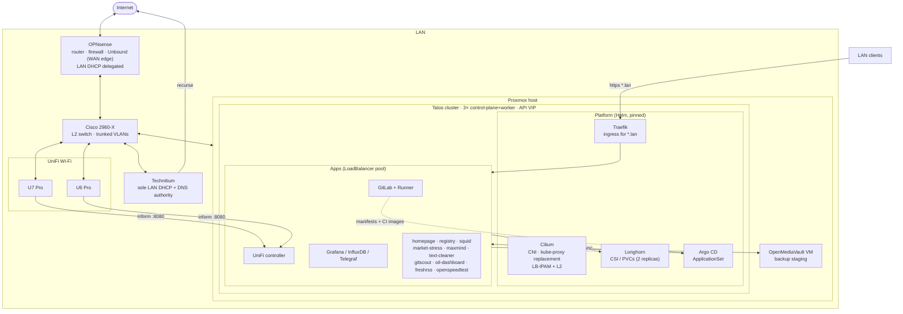
```mermaid
flowchart TB
    WAN([Internet])

    subgraph LAN["LAN"]
        OPN["OPNsense<br/>router · firewall · Unbound (WAN edge)<br/>LAN DHCP delegated"]
        SW["Cisco 2960-X<br/>L2 switch · trunked VLANs"]
        TECH["Technitium<br/>sole LAN DHCP + DNS authority"]

        subgraph WIFI["UniFi Wi-Fi"]
            AP1["U7 Pro"]
            AP2["U6 Pro"]
        end

        subgraph PVE["Proxmox host"]
            subgraph K8S["Talos cluster · 3× control-plane+worker · API VIP"]
                subgraph PLAT["Platform (Helm, pinned)"]
                    CIL["Cilium<br/>CNI · kube-proxy replacement<br/>LB-IPAM + L2"]
                    TRAEF["Traefik<br/>ingress for *.lan"]
                    LH["Longhorn<br/>CSI / PVCs (2 replicas)"]
                    ARGO["Argo CD<br/>ApplicationSet"]
                end
                subgraph APPS["Apps (LoadBalancer pool)"]
                    GL["GitLab + Runner"]
                    UNIFI["UniFi controller"]
                    OBS["Grafana / InfluxDB / Telegraf"]
                    MISC["homepage · registry · squid<br/>market-stress · maxmind · text-cleaner<br/>gitscout · oil-dashboard · freshrss · openspeedtest"]
                end
            end
            NAS["OpenMediaVault VM<br/>backup staging"]
        end
    end

    WAN <--> OPN <--> SW
    SW <--> TECH
    SW <--> PVE
    SW <--> AP1 & AP2
    TECH -->|recurse| WAN

    AP1 & AP2 -->|inform :8080| UNIFI
    CLIENT["LAN clients"] -->|https *.lan| TRAEF --> APPS
    APPS -->|volumes| LH
    APPS -->|staging| NAS
    GL -. "manifests + CI images" .-> ARGO -->|sync| APPS
```

## Proxmox host and storage tiers

Storage is tiered deliberately by cache and redundancy. The origin of the design
was a concrete failure: the Talos control-plane VMs first ran on the cacheless
H240ar spinning array; under I/O pressure etcd could not `fsync` within its election
timeout and entered leader-election churn, degrading the whole cluster. The fix was
to migrate every node disk — online, one node at a time, bandwidth-capped to protect
quorum — onto the P840 battery-backed RAID 10. Write-back cache backed by a battery
gives HDD arrays SSD-class `fsync` latency and survives mains loss by flushing on
power return, so no UPS is required for write integrity.

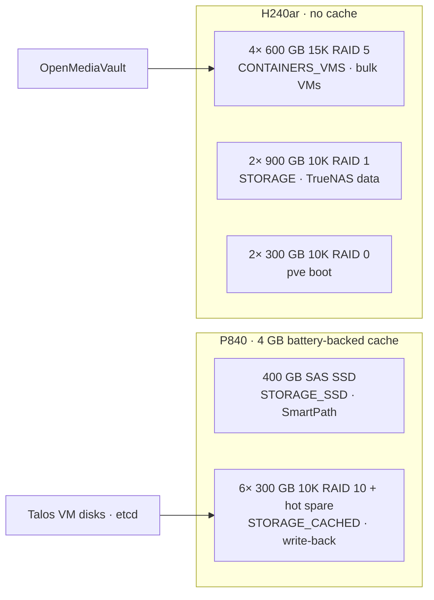
```mermaid
flowchart LR
    subgraph P840["P840 · 4 GB battery-backed cache"]
        SSD["400 GB SAS SSD<br/>STORAGE_SSD · SmartPath"]
        R10["6× 300 GB 10K RAID 10 + hot spare<br/>STORAGE_CACHED · write-back"]
    end
    subgraph H240["H240ar · no cache"]
        R5["4× 600 GB 15K RAID 5<br/>CONTAINERS_VMS · bulk VMs"]
        R1["2× 900 GB 10K RAID 1<br/>STORAGE · TrueNAS data"]
        R0["2× 300 GB 10K RAID 0<br/>pve boot"]
    end
    TALOS["Talos VM disks · etcd"] --> R10
    NASVM["OpenMediaVault"] --> R5
```

Recorded tradeoffs: the boot pair is RAID 0 (no fault tolerance) —
replacement with mirrored SSDs is hardware-gated and tracked in the backlog. Backup
staging currently lands on an OMV VM on the same host, so an encrypted off-host copy
plus a restore test are the top open items.

## Talos Kubernetes cluster

Three Talos Linux **v1.13.10** VMs, each a combined control-plane + worker, form an
etcd-HA cluster sharing an L2 virtual IP for the Kubernetes API (Kubernetes v1.36.4).

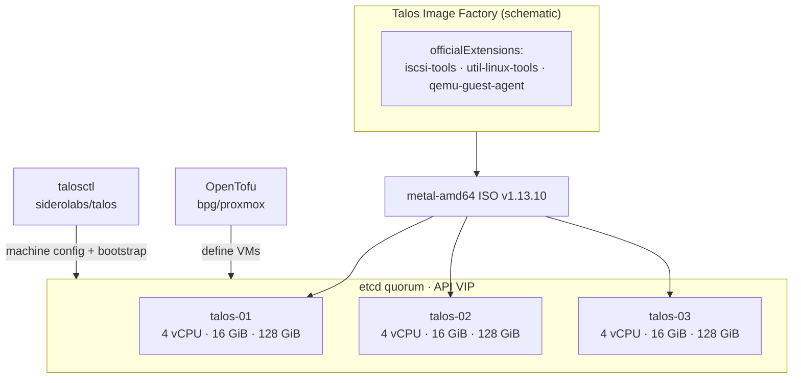
```mermaid
flowchart TB
    subgraph FACTORY["Talos Image Factory (schematic)"]
        EXT["officialExtensions:<br/>iscsi-tools · util-linux-tools · qemu-guest-agent"]
    end
    ISO["metal-amd64 ISO v1.13.10"] --> N1 & N2 & N3
    FACTORY --> ISO

    subgraph CLUSTER["etcd quorum · API VIP"]
        N1["talos-01<br/>4 vCPU · 16 GiB · 128 GiB"]
        N2["talos-02<br/>4 vCPU · 16 GiB · 128 GiB"]
        N3["talos-03<br/>4 vCPU · 16 GiB · 128 GiB"]
    end

    TOFU["OpenTofu<br/>bpg/proxmox"] -->|define VMs| CLUSTER
    TALOSCTL["talosctl<br/>siderolabs/talos"] -->|machine config + bootstrap| CLUSTER
```

Cluster properties enforced by config:

- **Immutable, API-only OS** — no SSH, no shell; all management via the Talos API.
- **etcd stability** — memory ballooning disabled (`floating = 0`), dedicated RAM only,
  disks on the battery-cached array, `aio = native` (Proxmox blocks `io_uring` → LVM).
- **Longhorn prerequisites** baked into the image via system extensions
  (`iscsi-tools`, `util-linux-tools`); `qemu-guest-agent` gives Proxmox guest-IP
  reporting and graceful shutdown.
- **Reproducible image** — the Factory schematic pins Talos version, platform, arch,
  and extension set to a single content-addressed ID.
- Destroy/rebuild of the entire cluster is validated.

## Platform layer

Helm-installed, every chart version-pinned in the repo.

| Component | Version | Function | Notable decision |
|---|---|---|---|
| **Cilium** | 1.20.1 (chart 1.20.1) | CNI, kube-proxy replacement, LB-IPAM + L2 announcements | Replaced MetalLB — its memberlist gossip was unstable alongside Cilium (ADR-002). L2 announced on the `ens18` interface; leader election via Kubernetes Leases. Hubble relay + UI enabled for cluster-wide flow observability. |
| **Traefik** | v3.7.13 (chart 41.5.0) | Single ingress for the `*.lan` wildcard zone | One wildcard DNS record fronts all cluster apps. Patched twice off the initial v3.7.6 pin to clear [GHSA-3ccp-42pg-hgv6](https://github.com/traefik/traefik/security/advisories/GHSA-3ccp-42pg-hgv6). |
| **Longhorn** | 1.12.1 | Replicated block storage / CSI, default StorageClass | `defaultReplicaCount = 2`; rebuild concurrency capped at 1 per node. Least-effort replica auto-balance enabled after a placement imbalance cascaded into an outage (see [Notable engineering incidents](#notable-engineering-incidents)). |
| **Argo CD** | v3.5.2 (chart 10.8.2) | GitOps engine | ApplicationSet git-directory generator creates one Application per `cluster/apps/*`. |
| **Sealed Secrets** | 0.39.1 | Secrets committed to git as ciphertext | Sealing key is part of the backup set. |
| **metrics-server** | chart 3.14.0 (app 0.9.0) | Resource metrics (`kubectl top`) | |
| **registry:3** | 3.1.1 | In-cluster image registry fed by CI | Chosen over the GitLab registry to avoid a `gitlab-ctl reconfigure` on the primary GitLab; Talos trusts it via an HTTP registry mirror (no reboot). PVC grown 10Gi→20Gi after legitimate SHA-tag churn filled it; tag-retention policy is still open. |

## GitOps delivery

Every workload is a manifest in one repository. CI builds images with kaniko (no
Docker daemon) and pushes SHA-tagged images to the in-cluster registry; Argo CD syncs
manifests from the same repo. Verified end-to-end: editing a replica count in git and
pushing causes Argo to apply the change with no `kubectl`.

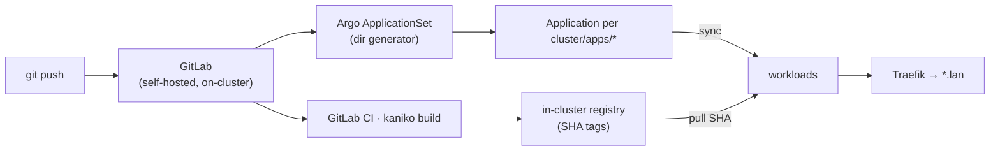
```mermaid
flowchart LR
    DEV["git push"] --> GLREPO["GitLab<br/>(self-hosted, on-cluster)"]
    GLREPO --> CI["GitLab CI · kaniko build"]
    CI --> REG["in-cluster registry<br/>(SHA tags)"]
    GLREPO --> APPSET["Argo ApplicationSet<br/>(dir generator)"]
    APPSET --> APP["Application per cluster/apps/*"]
    APP -->|sync| WL["workloads"]
    REG -->|pull SHA| WL
    WL --> ING["Traefik → *.lan"]
```

CI gates on push: `tofu fmt`/`validate` and `kubeconform` manifest validation.

## DNS and remote access

DNS is split by responsibility:

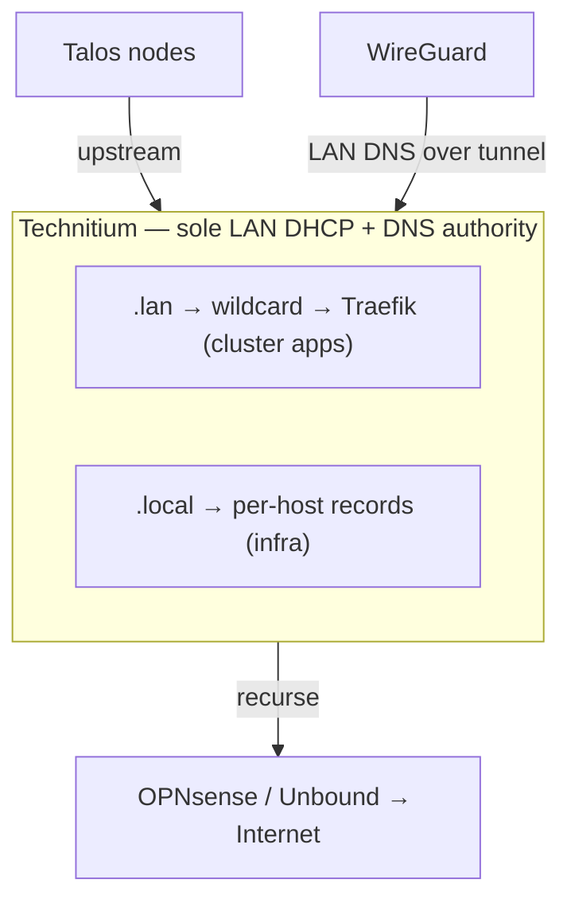
```mermaid
flowchart TB
    subgraph AUTH["Technitium — sole LAN DHCP + DNS authority"]
        LAN[".lan → wildcard → Traefik (cluster apps)"]
        LOCAL[".local → per-host records (infra)"]
    end
    NODES["Talos nodes"] -->|upstream| AUTH
    AUTH -->|recurse| EDGE["OPNsense / Unbound → Internet"]
    WG["WireGuard"] -->|LAN DNS over tunnel| AUTH
```

- `*.lan` resolves to Traefik: one wildcard record covers every cluster app.
- `*.local` holds per-host records for infrastructure (Proxmox, NAS, firewall, etc.).
- **WireGuard** provides remote access with LAN DNS resolution over the tunnel.

## Operator access: jump hosts

Two OpenTofu-provisioned jump hosts, each rebuildable from code with secrets held outside
Terraform state and cloud-init, give operator access without exposing management surfaces to
the wider LAN.

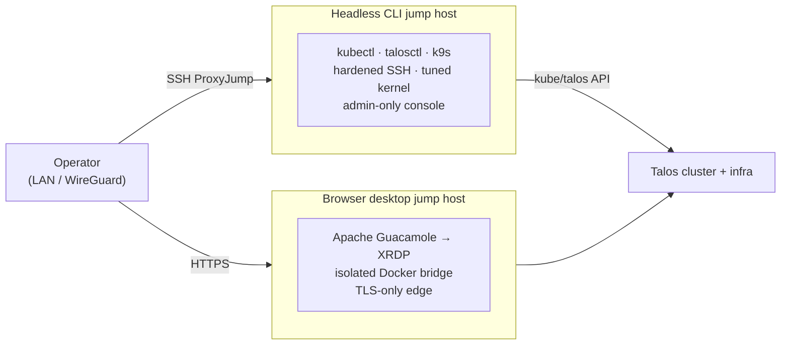
```mermaid
flowchart LR
    OP["Operator<br/>(LAN / WireGuard)"]
    subgraph CLI["Headless CLI jump host"]
        TOOLS["kubectl · talosctl · k9s<br/>hardened SSH · tuned kernel<br/>admin-only console"]
    end
    subgraph GUI["Browser desktop jump host"]
        GUAC["Apache Guacamole → XRDP<br/>isolated Docker bridge<br/>TLS-only edge"]
    end
    OP -->|SSH ProxyJump| CLI
    OP -->|HTTPS| GUI
    CLI -->|kube/talos API| CL["Talos cluster + infra"]
    GUI --> CL
```

- **Headless CLI jump host** — minimal hardened Ubuntu VM, the single `ProxyJump` entry point.
  Key-only SSH, root/password login and agent-forwarding disabled, TCP-forwarding retained for
  jump duty; checksum-verified operator toolchain (kubectl, talosctl, k9s, diagnostics), a tuned
  low-latency kernel, and a browser admin console reachable only from administrator networks.
- **Browser desktop jump host** — persistent Ubuntu GNOME desktop delivered entirely through the
  browser via Apache Guacamole. The remote-desktop protocol runs over an isolated Docker bridge and
  is never published to the LAN; only TLS is exposed at the edge, to administrator networks only.
  Same cluster tooling, for graphical workflows.

Both self-register DNS, generate dedicated SSH identities on first build, and reach the cluster
over WireGuard with no WAN port-forward. The whole lifecycle — image import, provisioning,
credential handling, DNS reconciliation, service validation — is one `tofu apply` plus a wrapper.

## Workloads

**Self-hosted / third-party**

| App | Image | Function |
|---|---|---|
| GitLab CE + Runner | `gitlab-ce:19.3.1` · `gitlab-runner:v19.3.1` | Source control, CI, GitOps origin; Kubernetes-executor runner with Silo cache. A separate GitLab DR stack was built, then removed (see [Notable engineering incidents](#notable-engineering-incidents)). |
| UniFi Network | `linuxserver/unifi-network-application` (digest-pinned) + `mongo:7.0.40` | Wi-Fi controller; rebuilt from a `.unf` backup so both APs re-adopted without reset |
| Homepage | `gethomepage/homepage:v2.2.0` | Service portal |
| Backrest | `backrest:v1.14.1` (restic) | Backup UI to a NAS SFTP repository |
| Grafana / InfluxDB / Telegraf | `grafana:13.2.1` · `influxdb:2.9.1` · `telegraf:1.39.3` | Latency + host power/thermal telemetry |
| Silo | `pgsty/silo:RELEASE.2026-09-03T13-18-01Z` | S3-compatible object storage: runner cache + Longhorn backup target. Replaced MinIO after upstream `minio/minio` was archived (vendor moved to a commercial product) and left an S3 session-policy CVE ([GHSA-jjjj-jwhf-8rgr](https://github.com/minio/minio/security/advisories/GHSA-jjjj-jwhf-8rgr), CVSS 8.1) permanently unpatched; Docker Hub then deleted the image outright. Silo is a maintained fork — identical protocol, env vars, and on-disk format — so the cutover needed no data migration. |
| OpenSpeedTest | `openspeedtest/latest` (digest-pinned) | Browser-based LAN/WAN speed test |
| Squid | built | Forward proxy for LAN devices |
| Semaphore | `semaphore:v2.19.12` + `postgres:16.15` | Ansible automation UI |

**Self-built** (each delivered through the same GitOps flow)

| App | Function |
|---|---|
| gitscout | GitHub API scanner + dashboard (DuckDB) that flags exposed credentials in accessible repos; replaced apikey-monitor |
| oil-dashboard | Oil/gas market intelligence dashboard — scrapers, scenario engine, FastAPI + APScheduler refresh |
| freshrss | Self-hosted RSS/Atom reader; curated news corpus for a downstream summarization pipeline |
| market-stress | Market-stress collector + dashboard (Dukascopy feed) |
| maxmind-search | GeoLite2 IP geolocation lookup |
| text-cleaner | Stateless text cleanup utility |
| lan-ops / dns-sync | LAN operations stack; scheduled DNS-record sync (Python) |

Decommissioned since the last write-up: **apikey-monitor** (archived — superseded by gitscout),
**ollama-hunter** (removed), and a run of short-lived trading-bot experiments (ig-hedged-grid,
straddle-rotator, trend-chop) that were each rolled back within days of deployment.

## Consensus trading stack

A separate containerised system, isolated from the cluster but built to the same discipline —
declared, version-pinned, reproducible. A multi-agent decision system trades several commodity
markets under hard risk controls.

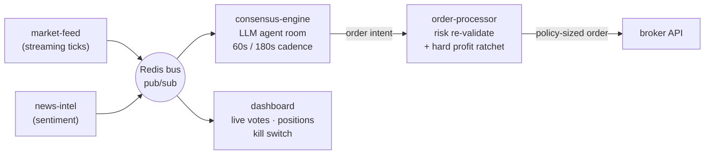
```mermaid
flowchart LR
    FEED["market-feed<br/>(streaming ticks)"] --> BUS(("Redis bus<br/>pub/sub"))
    NEWS["news-intel<br/>(sentiment)"] --> BUS
    BUS --> ENGINE["consensus-engine<br/>LLM agent room<br/>60s / 180s cadence"]
    ENGINE -->|order intent| ORDER["order-processor<br/>risk re-validate<br/>+ hard profit ratchet"]
    ORDER -->|policy-sized order| BROKER["broker API"]
    BUS --> DASH["dashboard<br/>live votes · positions<br/>kill switch"]
```

- **Isolation by design** — five services communicate only over Redis pub/sub. The dashboard never
  touches the broker; the order processor never touches the model pool.
- **Consensus, not a single model** — a room of LLM agents reviews open positions and candidate
  entries on a fixed cadence; an order is placed only on strong agreement with every risk gate
  passing.
- **Safety armed deliberately** — paper mode with synthetic fills is the default; a demo mode
  trades a sandbox; real-money mode requires an on-disk kill-switch token plus an explicit mode
  flag. A hard profit-protection layer runs independently of the model loop and can move the broker
  stop on every dealable tick.

## Observability: evidence, freshness, and lineage

Most homelab dashboards answer "what is the CPU doing?" This stack also answers "how old is
this number, and how much should I trust it?" Cluster metrics are treated as a data-quality
problem: every signal carries a freshness age, a lineage, and a confidence grade.

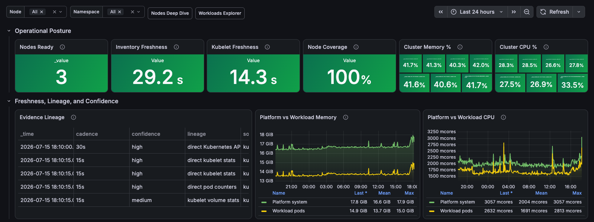

- **Freshness in seconds, not "green"** — inventory, kubelet, and pod-runtime freshness are
  surfaced as explicit ages (29 s, 14 s). A stalled exporter shows up as a rising number, not a
  silently flat line.
- **Evidence lineage** — each metric records how it was derived (direct Kubernetes API, direct
  kubelet stats, direct pod counters, kubelet volume stats) and its cadence (15 s / 30 s), so a
  value traces to its source instead of being trusted blindly.
- **Confidence grading** — signals are labelled high or medium confidence by derivation,
  separating measured facts from inferred estimates.
- **Platform vs workload split** — memory and CPU are attributed to platform overhead versus
  application pods, so capacity questions have a concrete answer.

The rest of the telemetry stack — host power/thermals, per-node deep dives, namespace and pod
drill-downs, SNMP switch health, and network SLA/latency — is in the
[Screenshots](#screenshots) gallery below.

## Notable engineering incidents

A few incidents from the last two months, each root-caused and fixed rather than patched over:

- **GitLab DR removed for a circular dependency.** A CronJob-based DR stack backed GitLab up to a
  Longhorn PVC, which itself backed up to in-cluster object storage — which also lived on Longhorn.
  "Disaster recovery" never actually left the disk it was meant to protect against. It surfaced as
  real Longhorn disk-pressure on one node. Removed rather than patched; true off-cluster DR is
  tracked as an open item below.
- **A replica-placement bug cascaded into an outage.** Longhorn had concentrated replicas on two of
  three nodes; a routine memory-ballooning rollout faulted 12 volumes at once on the idle node's
  neighbor, taking GitLab down and triggering a blind cluster-wide Argo CD sync. Fixed by enabling
  least-effort replica auto-balance.
- **MinIO forced off by an unpatchable CVE.** Upstream `minio/minio` was archived in April 2026 when
  MinIO Inc. pivoted to a commercial product, leaving a CVSS-8.1 S3 session-policy bypass
  ([GHSA-jjjj-jwhf-8rgr](https://github.com/minio/minio/security/advisories/GHSA-jjjj-jwhf-8rgr))
  permanently unfixed; Docker Hub then deleted the image outright. Migrated to Silo, a maintained
  fork with an identical on-disk format — no data migration step needed.
- **A network topology change blind-spotted its own dashboard.** Moving the management path to a
  new OVS bond and adding a lab bridge left the Proxmox Host dashboard silently querying interfaces
  that no longer existed, until the panels were reworked against the real bond/datapath state.
- **Alerting shipped, then had to fix its own false positives.** Email alerting went out over the
  existing Mailu stack with six starter rules; all six had to be paused within hours on false
  positives, then fixed in stages — a self-referential query bug, a missing reduce stage, and a
  tag-column issue breaking `max()` in two rules. Separately, the dashboard ConfigMap grew past
  Kubernetes' 256 KiB `last-applied-configuration` annotation limit and had to move to server-side
  apply.

Longer-form root-cause writeups (etcd `fsync` starvation, kernel PSI stalls, host power/thermal
tuning) are in the migration repository's documentation set — see [Documentation](#documentation)
below.

## Screenshots

Captured from the live cluster. Internal addresses masked; third-party data redacted.

**Homepage — service portal** (internal addresses masked)

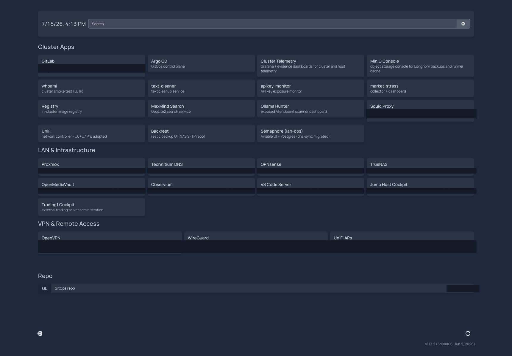

### Grafana dashboards

Self-built dashboards over InfluxDB/Telegraf. Captured live from the cluster; internal
IPs, hostnames, node/pod names, and `.lan` URLs are masked or kept out of frame.

**Proxmox Host** — CPU, load, memory, OVS NIC throughput, disk I/O, host power draw, live hardware temperatures

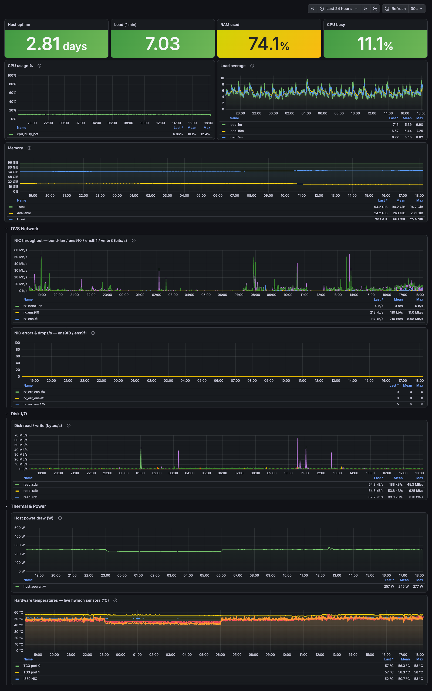

**Network Quality** — SLA ranking, latency & packet-loss trends, DNS resolution quality

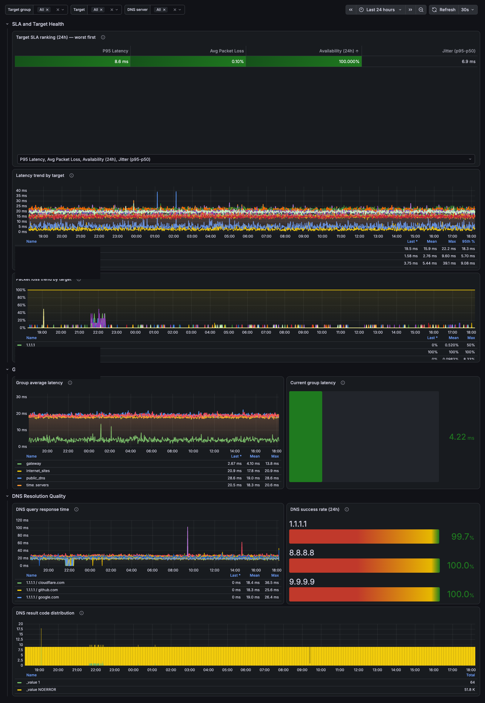

**Latency Operations Overview** — live latency/packet loss, target health ranking, per-group latency

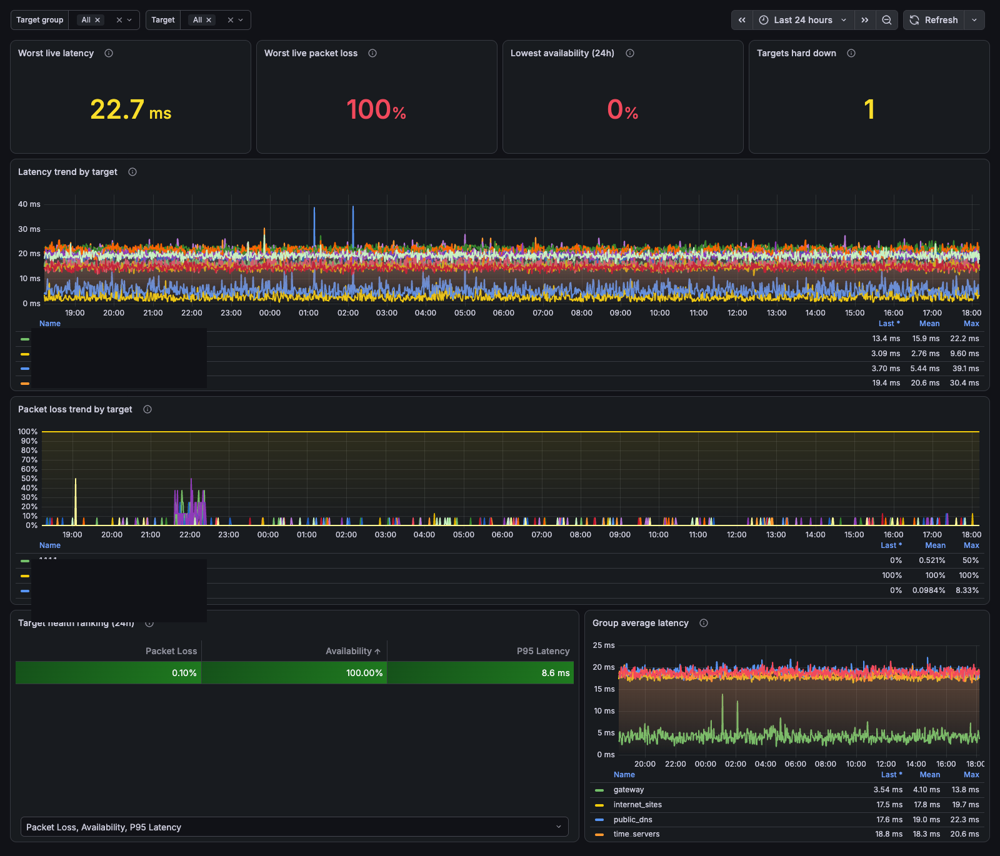

**market-stress** — self-built market-stress index and next-day model

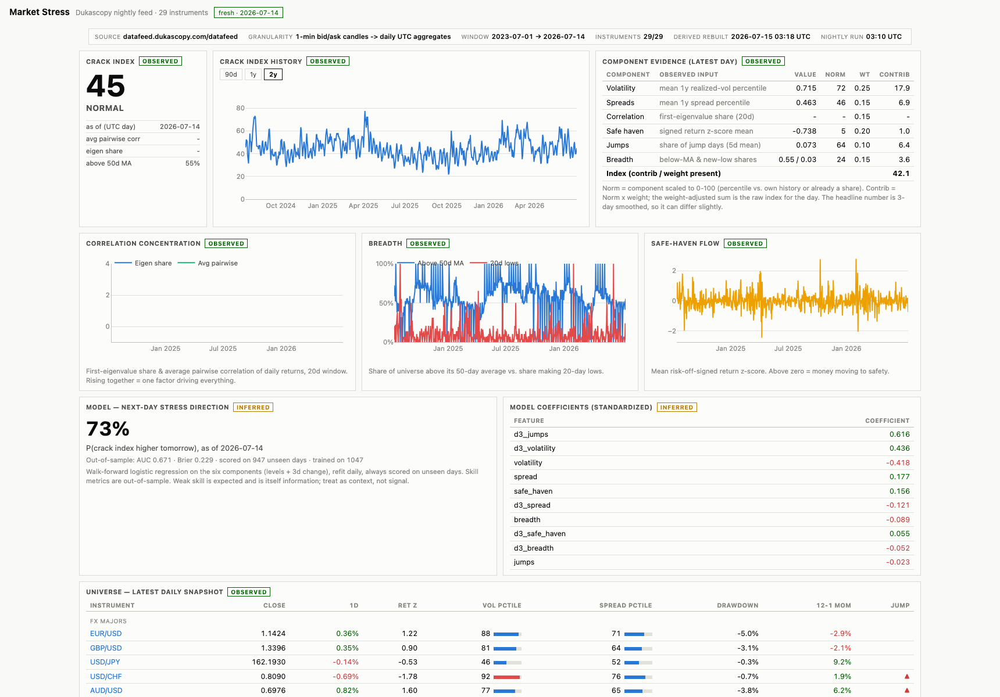

**apikey-monitor** (retired, screenshot kept for reference) — summary panel only; the list of
third-party vulnerable repositories is deliberately excluded

## Design tradeoffs and open items

| Item | State | Rationale |
|---|---|---|
| 2 app-tier nodes + 1 tainted platform node | Done, live since 2026-07-12 | etcd HA on scarce RAM; platform components (Argo, Traefik, metrics-server, Sealed Secrets) tolerate and land on the tainted node, app workloads are constrained to the other two |
| Node disks on battery-cached RAID 10 | Done | Eliminated the etcd `fsync`-starvation failure class |
| Full GitOps loop (git→CI→registry→Argo) | Done, verified | No click-ops; secrets sealed |
| Both legacy Docker hosts retired | Done | Cluster carries the entire live workload |
| True off-cluster disaster recovery | Open | Longhorn backs up to in-cluster Silo; GitLab DR was built, then removed for backing up onto the same disk it was meant to protect against |
| RAID 0 boot → mirrored SSDs | Open (hardware-gated) | Boot array has no fault tolerance |
| Platform charts → Argo-managed Applications | Open (ADR-001) | Cilium stays bootstrap (it is the CNI); the rest convert to GitOps |
| In-cluster registry auth/TLS | Open | LAN-only, HTTP; add basic-auth + TLS before it holds anything sensitive |
| Alerting, placement policy, DNS hygiene | In progress | Soak-phase day-2 work |

## Documentation

The migration repository carries 30+ operational documents: a pre-migration inventory
captured from live `docker ps`/volume reads, phased design docs, build and cutover
runbooks, two root-cause analyses, a hardware/storage remediation report, and ADRs for
each non-obvious decision.

A parallel set of performance investigations traces concrete incidents to root cause:
etcd `fsync` starvation on uncached storage, kernel pressure-stall (PSI) stalls under I/O
load, and host power/thermal tuning — each written up with the measurement, the hypothesis,
and the fix that was verified afterwards.

## Software inventory

Full list with pinned versions and upstream links: **[INVENTORY.md](INVENTORY.md)**

## Version audit and recurring SOP

The dated update assessment, read-only recurring procedure, and agent handoff
instructions are in **[VERSION-AUDIT.md](VERSION-AUDIT.md)**.

## Upgrade execution plan

The dependency-ordered maintenance waves, go/no-go gates, rollback boundaries,
and branch-to-rollout procedure are in **[UPGRADE-PLAN.md](UPGRADE-PLAN.md)**.
