# Homelab Upgrade Execution Plan

This plan converts the version findings in [VERSION-AUDIT.md](VERSION-AUDIT.md)
into separate, dependency-ordered changes. It was prepared on 2026-07-22 and
must be refreshed against official upstream sources immediately before use.

The objective is controlled progress, not one large maintenance event. Every
wave has its own branch or change record, validation, rollback boundary, and
soak period.

## Non-negotiable rules

1. Start from the exact deployment repository `master` revision used by Argo CD,
   not an unrelated local branch or stale remote-tracking reference.
2. Run only one platform, storage, network, host, or stateful change at a time.
3. Do not combine Cilium, Talos, Longhorn, Proxmox, GitLab, or OPNsense changes.
4. A Longhorn snapshot on the same cluster is not an off-cluster backup.
5. Do not merge a GitOps change until CI passes and the maintenance window is
   open. A pushed branch is preparation, not approval to deploy.
6. Do not move to the next wave while health is degraded or the rollback path is
   unverified.
7. Re-resolve every mutable image tag to its current digest immediately before
   committing it.

## Change lanes

| Lane | Delivery mechanism | Runtime effect | Handling |
|---|---|---|---|
| A: repository-only | Commit, branch pipeline, merge request | No workload rollout | Pin CI tools, constraints, documentation, and validation rules. Merge after CI and review. |
| B: GitOps application | Commit, CI, merge, Argo CD sync | Pod rollout; possible stateful restart | One application group per merge request. Back up state first and observe the rollout. |
| C: cluster platform | Helm/Talos change under a window | Networking, control plane, node, or storage impact | One component at a time with console access and a tested rollback path. |
| D: host and edge | Native package or appliance updater | Reboot, whole-cluster interruption, or network-edge impact | Dedicated outage window with off-host backups and local console access. |

## Dependency and isolation map

```mermaid
flowchart LR
    P["Wave 0: preflight and recovery gates"] --> R["Wave 1: repo-only pins"]
    R --> O["Wave 2: OMV patch and backup-path proof"]
    O --> A["Wave 3: Argo CD chart patch"]
    A --> S["Wave 4: application patch branches"]
    S --> C["Wave 5: Cilium patch"]
    C --> T["Wave 6: Talos nodes, one at a time"]
    T --> H["Wave 7: Proxmox packages and kernel"]
    H --> G["Wave 8: GitLab required stop and Runner"]
    G --> F["Wave 9: OPNsense major upgrade"]
    F --> U["Wave 10: unresolved firmware and appliances"]
```

The arrows define the recommended execution order and soak points. They do not
mean that unrelated systems have a technical dependency on each other.

## Current queue

| Wave | Scope | Current to target | Delivery | Risk | Status |
|---:|---|---|---|---|---|
| 0 | Recovery and health gates | Current baseline | Read-only checks and backup verification | Blocking gate | Required before every wave |
| 1 | CI images and OpenTofu/provider ranges | OpenTofu 1.12.5, kubeconform 0.7.0, Python 3.13.14 | Repository branch and CI | Low | Branch `chore/pin-ci-toolchain-2026-07-22`, commit `82e48a8`, prepared |
| 2 | OpenMediaVault packages | 8.5.1 to 8.5.4 | Native package update | Low to medium | Ready after backup-job check |
| 3 | Argo CD Helm chart | 10.1.3 to 10.1.4 | Platform chart commit/apply | Medium | Ready for separate branch |
| 4A | Grafana and Telegraf | 13.1.0 to 13.1.1; 1.39.1 to 1.39.2 | GitOps image pins | Low to medium | Ready for separate branch |
| 4B | InfluxDB and helper digests | 2.9.1 digest refresh; Debian 13 digest refresh | GitOps digest pins | Medium, stateful | Needs InfluxDB backup |
| 4C | Semaphore and PostgreSQL pin | 2.18.27 to 2.18.28; pin PostgreSQL 16.14 | GitOps image pins | Medium, stateful | Needs database backup |
| 4D | UniFi and MongoDB pin | 10.4.57-ls136 to ls138; pin MongoDB 7.0.37 | GitOps image pins | Medium, stateful | Needs `.unf` and database backups |
| 5 | Cilium | 1.19.5 to 1.19.6 | Helm/GitOps platform change | High, cluster network | Dedicated window |
| 6 | Talos Linux | 1.13.6 to 1.13.7 | Talos Image Factory and node upgrade | High, node kernel/runtime | Dedicated window, one node at a time |
| 7 | Proxmox VE | manager 9.2.4 to 9.2.5; kernel 7.0.14-4 to 7.0.14-6 | Host package transaction and reboot | High, whole cluster | Dedicated host window |
| 8 | GitLab CE and Runner | 19.1.2 to required stop 19.2; Runner 19.1.1 to 19.2 | Stateful application upgrade | High | Dedicated backup and migration window |
| 9 | OPNsense | 26.1.11_6 to 26.7.1 | Major appliance upgrade | Critical, network edge | Dedicated outage and console |
| 10 | TrueNAS, Technitium, AP, switch, HPE firmware | Unverified | Vendor-specific | Unknown to critical | Inventory and access first |

## Wave 0: go/no-go gates

Record evidence for all of these immediately before each maintenance change:

- All three Kubernetes nodes are Ready and the etcd member list is healthy.
- All Argo CD applications are Synced and Healthy at the expected Git revision.
- No unexpected pod is Pending, Failed, CrashLooping, or repeatedly restarting.
- All attached Longhorn volumes are healthy with expected replicas. Identify the
  detached volume with unknown robustness before deleting or reusing anything.
- The most recent etcd snapshot and application backups exist outside the
  cluster, and the restore instructions are available.
- The OpenMediaVault staging path and off-host backup path both work.
- Proxmox and OPNsense have local or out-of-band console access.
- No backup, storage rebuild, Longhorn replica rebuild, or unrelated rollout is
  active.
- The previous known-good Git revision, image digests, chart values, Talos
  schematic, host kernel, and appliance configuration are recorded.

Any failed gate stops the wave. Fix the baseline first; do not use an upgrade as
an attempted repair.

## Wave 1: repository-only low-hanging fruit

The prepared branch makes no live infrastructure or workload change. It:

- replaces floating OpenTofu and kubeconform CI images with exact tags and
  digests;
- advances the dashboard validator to `python:3.13.14-alpine3.23` at an exact
  digest;
- constrains OpenTofu to the tested 1.12 release line;
- constrains the Proxmox and Talos providers to their tested stable release
  lines while retaining locked versions 0.111.1 and 0.11.0.

Required closeout:

1. Confirm all three GitLab validation jobs pass.
2. Review that the branch changes only CI configuration, version constraints,
   and lock metadata.
3. Open a merge request; do not squash it with a workload update.
4. Merge, then run one normal validation pipeline from `master`.
5. Update the operator workstation to OpenTofu 1.12.5 before the next plan.

Rollback is a normal commit revert. No live recovery action is required.

## Wave 2: backup staging host

OpenMediaVault is a small package update but participates in recovery, so prove
the backup path before using it for later waves.

1. Confirm that no backup, scrub, SMART test, or large transfer is running.
2. Capture the package list and simulate the final package transaction.
3. Verify an off-box copy exists for data that is only staged on this VM.
4. Apply the 8.5.4 update and reboot only if the package transaction requires it.
5. Verify mounts, free space, SMART state, SFTP access, and one test backup file.
6. Run and verify the next scheduled backup before closing the wave.

## Wave 3: Argo CD chart patch

Patch the Argo CD chart before asking it to coordinate application waves.

1. Create a branch containing only chart 10.1.3 to 10.1.4 and regenerated
   rendered output, if the repository stores it.
2. Compare effective values with the current release; do not accept unrelated
   default changes.
3. Run chart rendering, schema validation, and repository CI.
4. Apply in a dedicated window and verify every Argo component becomes Ready.
5. Confirm all 17 applications remain Synced and Healthy and repository access
   still works.

Rollback to the recorded Helm revision and restore the previous Git pin if Argo
does not recover cleanly.

## Wave 4: application patch branches

Use one merge request per row in Wave 4. Never combine a database/image digest
change with the platform or host waves.

For every branch:

1. Resolve the target tag to an exact platform digest and record the upstream
   release link.
2. Change all references for that component together.
3. Run kubeconform, dashboard validation where applicable, and GitLab CI.
4. Take the named application backup immediately before merge.
5. Merge, watch Argo sync and Kubernetes rollout events, then run service-specific
   smoke checks.
6. Confirm persistent data, authentication, logs, metrics, and the next backup.
7. Soak the change before starting the next application branch.

Rollback for a stateless image patch is a Git revert. For InfluxDB, PostgreSQL,
MongoDB, GitLab, and UniFi, do not assume an older image can read data after a
migration. Stop and use the application-specific restore boundary.

## Wave 5: Cilium network patch

Follow the official Cilium upgrade guide. Preserve the complete existing Helm
values, run the preflight checks, and do not use `--reuse-values` as a substitute
for reviewed values.

Validate after rollout:

- Cilium and operator pods are Ready on every node.
- Endpoint health, DNS, service routing, LoadBalancer IP allocation, and L2
  announcements are healthy.
- Ingress works from a LAN client and inter-pod traffic works across nodes.
- No Longhorn or application pod is isolated by the network change.

If validation fails, stop application changes and roll back to the recorded Helm
revision and Git values. Do not begin the Talos wave until Cilium has soaked.

## Wave 6: Talos patch, one node at a time

This wave updates Talos, the node kernel, containerd, and bundled components. It
must not overlap with Cilium, Longhorn, or Proxmox maintenance.

1. Use `talosctl` 1.13.6 to match the running cluster at the start of the change.
2. Produce the Talos 1.13.7 Image Factory image from the existing schematic and
   verify the required iSCSI, util-linux, and QEMU guest-agent extensions remain.
3. Capture an external etcd snapshot and verify Longhorn replica placement.
4. Upgrade one node. Wait for Talos health, Kubernetes Ready state, etcd quorum,
   Cilium readiness, and Longhorn replica health to recover fully.
5. Repeat for the second node, then the third. Never take two nodes down together.
6. Re-run full cluster, Argo, storage, DNS, ingress, and application checks.
7. Update the workstation client and repository pin to 1.13.7 after the servers
   are healthy.

Do not improvise an etcd restore during a routine node rollback. Stop after a
failed node, preserve quorum, and use the recorded prior Factory image and the
official Talos recovery procedure.

## Wave 7: Proxmox packages and kernel

This is a whole-cluster risk even if the package update itself looks routine.
The host currently has third-party XanMod kernels installed as well as the active
PVE kernel; their purpose must be understood before changing boot configuration
or removing packages.

1. Verify off-host VM backups and record VM autostart order and the active boot
   kernel.
2. Confirm the PVE kernel is the intended boot default and inspect the simulated
   full-upgrade transaction for removals, held packages, and repository errors.
3. Do not remove XanMod packages in the same window.
4. Apply the reviewed Proxmox package transaction.
5. Confirm the new PVE kernel is installed and the previous PVE kernel remains
   available as the boot fallback.
6. Use the existing safe-reboot runbook. Expect the entire Talos cluster and all
   applications to stop while the single physical host reboots.
7. Verify storage controllers, network links, VM autostart, all Talos nodes, etcd,
   Cilium, Longhorn, Argo CD, and applications.

If the new kernel fails, use local console access to boot the recorded previous
PVE kernel. Do not remove the working fallback until a later maintenance window.

## Wave 8: GitLab required upgrade stop

GitLab 19.2 is a required upgrade stop. Re-check the official upgrade path and
select the latest available 19.2 patch at execution time, not automatically the
first 19.2.0 image found during this audit.

1. Confirm current background migrations are complete.
2. Take and verify the GitLab recovery set: database, repositories, configuration,
   secrets, uploads, and registry state as applicable.
3. Pin the exact GitLab target tag and digest in its own branch and pass CI.
4. Upgrade GitLab first and wait for migrations and health checks to complete.
5. Validate login, clone, push, merge request, registry access, Argo repository
   access, and a real project pipeline.
6. Upgrade Runner only after the server is healthy, then test the Kubernetes
   executor and object-cache path.

An application downgrade after database migrations is not the default rollback.
Use the GitLab-version-specific restore procedure and the complete pre-upgrade
backup.

## Wave 9: OPNsense major upgrade

Treat 26.1 to 26.7 as a network-edge outage, not a package patch.

1. Export and securely store `config.xml` and record interface assignments.
2. Confirm local console access that does not depend on routing, DNS, or VPN.
3. Review every release and migration note between the installed and target
   versions, including firewall and source NAT changes.
4. Upgrade in a dedicated outage with no simultaneous cluster or host work.
5. Validate WAN, LAN, VLANs, DHCP delegation, DNS forwarding, NAT, firewall rules,
   WireGuard, NTP, and access to cluster services.
6. Keep the previous installer/configuration recovery path available until the
   edge has soaked.

## Wave 10: unresolved inventory

Do not schedule firmware or appliance upgrades until the current model, version,
support status, configuration backup, release notes, and recovery access are
recorded for:

- TrueNAS and its ZFS pool health;
- Technitium DNS/DHCP;
- UniFi access-point firmware;
- Cisco switch firmware and saved startup configuration;
- HPE iLO, system ROM, Smart Array controllers, disk firmware, and NIC firmware;
- Observium and any workloads not yet represented by authoritative live state.

Firmware changes should be split by failure domain. Controller, disk, NIC, switch,
and server firmware do not belong in one maintenance window.

## Standard branch-to-rollout procedure

Use this procedure for every repository-driven wave:

1. Re-run the read-only version audit and health gates.
2. Resolve the exact remote `master` SHA and create an isolated worktree from it.
3. Create one branch named for one blast radius.
4. Change exact tags, digests, chart versions, constraints, and related validation
   together; preserve unrelated working-tree changes.
5. Run the narrow local validators, inspect the complete diff, and push the branch.
6. Wait for every GitLab CI job. A skipped or missing expected job is not a pass.
7. Open and review a merge request. Record backup evidence, validation, rollback,
   owner, and maintenance window.
8. Merge only during the approved window, then observe Argo or the native updater.
9. Run service smoke tests, platform health checks, and the next scheduled backup.
10. Record the deployed revision and result in the audit history.

## Stop conditions

Stop immediately and preserve evidence if any of these occurs:

- etcd loses quorum or a second Talos node becomes unhealthy;
- an attached Longhorn volume becomes degraded or data detaches unexpectedly;
- Cilium loses cross-node connectivity, DNS, LB-IPAM, or L2 announcements;
- Argo CD cannot read the repository or applications diverge unexpectedly;
- a stateful workload starts a migration not covered by the reviewed plan;
- the Proxmox package transaction removes required PVE packages or selects an
  unintended kernel;
- GitLab background migrations fail;
- OPNsense console access, WAN, LAN, DHCP, DNS, NAT, or VPN validation fails;
- the backup or restore evidence is missing.

Do not continue to the next wave merely because some services appear usable.

## Official execution references

- [Cilium upgrade guide](https://docs.cilium.io/en/stable/operations/upgrade/)
- [Talos upgrade guide](https://docs.siderolabs.com/talos/v1.13/configure-your-talos-cluster/lifecycle-management/upgrading-talos)
- [GitLab upgrade paths](https://docs.gitlab.com/update/upgrade_paths/)
- [Proxmox VE system software updates](https://pve.proxmox.com/pve-docs/chapter-sysadmin.html#system_software_updates)
- [OPNsense 26.7 release notes](https://docs.opnsense.org/releases/CE_26.7.html)
- [Argo Helm releases](https://github.com/argoproj/argo-helm/releases)

