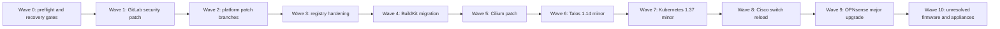

# Homelab Upgrade Execution Plan

This plan converts the version findings in [VERSION-AUDIT.md](VERSION-AUDIT.md)
into separate, dependency-ordered changes. It was refreshed on 2026-09-17,
then updated 2026-09-18 with a live-verified execution pass (see the Current
queue Status column and "Execution log — 2026-09-18" below) — and must still
be refreshed against official upstream sources immediately before further use.

The objective is controlled progress, not one large maintenance event. Every
wave has its own branch or change record, validation, rollback boundary, and
soak period.

## Non-negotiable rules

1. Start from the exact deployment repository `master` revision used by Argo CD,
   not an unrelated local branch or stale remote-tracking reference.
2. Run only one platform, storage, network, host, or stateful change at a time.
3. Do not combine Cilium, Talos, Longhorn, Proxmox, GitLab, or OPNsense changes.
4. A Longhorn snapshot on the same cluster is not an off-cluster backup. This is
   not theoretical here: a GitLab DR stack was built, then removed in September
   2026 because it backed up onto the same Longhorn-backed storage it was meant
   to protect against — see the completed-work log below.
5. Do not merge a GitOps change until CI passes and the maintenance window is
   open. A pushed branch is preparation, not approval to deploy.
6. Do not move to the next wave while health is degraded or the rollback path is
   unverified.
7. Re-resolve every mutable image tag to its current digest immediately before
   committing it.

## Immediate security priority

`gitlab-ce:19.3.1-ce.0` is in the vulnerable range for
[CVE-2026-85706](https://docs.gitlab.com/releases/patches/patch-release-gitlab-19-3-2-released/)
(CVSS 10.0, path traversal in the repository commits API), which GitLab's
advisory states is on CISA's Known Exploited Vulnerabilities catalog. The fix
is GitLab **19.3.2**, released 2026-09-10. This is the next action, ahead of
every routine patch below:

1. Confirm current background migrations are complete before starting.
2. Take and verify the full GitLab recovery set: database, repositories,
   configuration, secrets, uploads, and registry state as applicable.
3. Pin the exact `19.3.2` tag and digest in its own branch and pass CI.
4. Upgrade GitLab first and wait for migrations and health checks to complete.
5. Validate login, clone, push, merge request, registry access, Argo repository
   access, and a real project pipeline.
6. Upgrade Runner to the matching `v19.3.2` (or later compatible) release only
   after the server is healthy, then run a real Kubernetes-executor pipeline
   and Silo cache test.
7. While in this window, confirm the sealed GitHub token used by `gitscout` is
   still valid — it expired and crash-looped the scanner for over a week in
   early September before being resealed. A token-rotation runbook is worth
   writing if one does not already exist.

An application downgrade after database migrations is not the default
rollback. Use the GitLab-version-specific restore procedure and the complete
pre-upgrade backup.

## Change lanes

| Lane | Delivery mechanism | Runtime effect | Handling |
|---|---|---|---|
| A: repository-only | Commit, branch pipeline, merge request | No workload rollout | Pin CI tools, constraints, documentation, and validation rules. Merge after CI and review. |
| B: GitOps application | Commit, CI, merge, Argo CD sync | Pod rollout; possible stateful restart | One application group per merge request. Back up state first and observe the rollout. |
| C: cluster platform | Helm/Talos change under a window | Networking, control plane, node, or storage impact | One component at a time with console access and a tested rollback path. |
| D: host and edge | Native package or appliance updater | Reboot, whole-cluster interruption, or network-edge impact | Dedicated outage window with off-host backups and local console access. |

Traefik, Cilium, Longhorn, and Argo CD are currently CLI/Helm-managed rather
than Argo-managed (ADR-001 is still open). Their repository merge requests
update reviewed values, version records, and runbook commands; merging those
changes does not perform the live Helm operation.

## Dependency and isolation map

```mermaid
flowchart LR
    P["Wave 0: preflight and recovery gates"] --> X["Wave 1: GitLab security patch"]
    X --> R["Wave 2: platform patch branches"]
    R --> H["Wave 3: registry hardening"]
    H --> B["Wave 4: BuildKit migration"]
    B --> C["Wave 5: Cilium patch"]
    C --> T["Wave 6: Talos 1.14 minor"]
    T --> K["Wave 7: Kubernetes 1.37 minor"]
    K --> E["Wave 8: Cisco switch reload"]
    E --> F["Wave 9: OPNsense major upgrade"]
    F --> U["Wave 10: unresolved firmware and appliances"]
```

The arrows define the recommended execution order and soak points. They do not
mean that unrelated systems have a technical dependency on each other.

## Completed since the last plan (2026-07-28 to present)

Recorded here so the queue below only shows what is actually still open:

- Traefik patched twice: v3.7.6 (chart 41.0.2) to v3.7.10 (chart 41.2.0) for
  GHSA-3ccp-42pg-hgv6, then to v3.7.13 (chart 41.5.0) — now matches upstream.
- Talos rolled node-by-node from v1.13.6 to v1.13.10 (five patches).
- Kubernetes advanced from 1.36.2 to 1.36.4 through Talos.
- Cilium upgraded 1.19.5 to 1.20.1; Hubble relay and UI enabled.
- Longhorn upgraded to 1.12.1; least-effort replica auto-balance enabled after
  an imbalanced-replica outage.
- Argo CD chart upgraded 10.1.3 to 10.8.2 (app v3.5.2).
- Sealed Secrets upgraded 0.38.4 to 0.39.1; metrics-server chart adopted app
  0.9.0.
- GitLab upgraded 19.1.2 through 19.2.x to 19.3.1; Runner tuned and kept in
  step.
- Grafana 13.1.0 to 13.2.1; Telegraf 1.39.1 to 1.39.3; InfluxDB held at 2.9.1.
- Semaphore 2.18.27 to 2.19.12; PostgreSQL and MongoDB pinned to exact patch
  tags (16.15-alpine, 7.0.40) instead of generic tags.
- MinIO fully replaced by Silo after the upstream project was archived and a
  CVSS-8.1 CVE went permanently unpatched (GHSA-jjjj-jwhf-8rgr); no data
  migration was needed.
- GitLab DR stack built, then removed after root-causing a circular backup
  dependency (see Non-negotiable rule 4).
- gitscout replaced apikey-monitor (archived); oil-dashboard, FreshRSS, and
  OpenSpeedTest were added; ollama-hunter and a run of short-lived trading-bot
  experiments were removed.
- Registry PVC expanded 10Gi to 20Gi after legitimate image-tag churn filled it.

## Current queue

| Wave | Scope | Current to target | Delivery | Risk | Status |
|---:|---|---|---|---|---|
| 0 | Recovery and health gates | Current baseline | Read-only checks and backup verification | Blocking gate | **Partially cleared 2026-09-18**: node/pod/Argo/Longhorn health all live-confirmed good. Backup evidence for GitLab NOT cleared — `backrest` pod is `Running` but its snapshot state could not be inspected this pass (exec/logs access declined). This is the reason Wave 1 is still blocked. |
| 1 | GitLab critical security patch | 19.3.1-ce.0 / v19.3.1 to 19.3.2 | Stateful application upgrade | Critical, actively-exploited CVE | **Blocked on Wave 0.** CVE re-confirmed live and current 2026-09-18 (still the latest fix). GitLab's volume was added to the `backup-dr` group and a real backup was attempted (not just checked) — it failed: Silo (`minio/minio-data`, 15Gi PVC) is out of space. Same failure hit `unifi-db-data`, a previously-working backup, in the same run. Do not proceed until this is fixed and a successful GitLab backup is confirmed to exist. |
| 1a | Silo capacity (new, found 2026-09-18) | `minio/minio-data` PVC, 15Gi, full | PVC resize + retention review | Blocking Wave 1; also degraded existing coverage | Grow `minio-data`, then re-run `daily-backup` for `gitlab-data` and re-confirm `unifi-db-data` recovers. Size to hold GitLab's full backup plus existing retained sets (7 daily + 4 weekly) with headroom, not to the current minimum. |
| 2A | Cilium | 1.20.1 to 1.20.2 | Native Helm upgrade | High, cluster network | **Done, live-verified 2026-09-18.** Helm rev 13; all 3 nodes stayed `Ready`, 0 unhealthy pods, LB-IPAM/DNS/Hubble confirmed intact. |
| 2B | Argo CD chart | 10.8.2 to 10.9.2 (app v3.5.2 to **v3.5.3**) | Native Helm upgrade | Medium | **Done, live-verified 2026-09-18.** Helm rev 7; all 18 managed Applications reconfirmed Synced+Healthy after. |
| 2C | Sealed Secrets | 0.39.1 to 0.40.0 | `kubectl apply` + `kubeseal` CLI | Medium | **Done, live-verified 2026-09-18.** Reseal compatibility proven both directions (existing secrets intact; new synthetic secret round-tripped correctly), not just checked-then-hoped. |
| 2D | Grafana | 13.2.1 to 13.2.2 | GitOps image pin | Low to medium | **Done, live-verified 2026-09-18** — `homelab-k8s-migration@311bc3b`, pushed, Argo synced, pod confirmed on new digest. |
| 2E | Telegraf | 1.39.3 to 1.40.0 (minor) | GitOps image pin | Medium | **Done, live-verified 2026-09-18** — same commit as 2D; all 5 telegraf pods confirmed on new digest. |
| 3 | Registry hardening | No auth/TLS, no retention policy | Repository MR + native config | Medium, exposure | Not touched this pass. |
| 4 | Local build engine | Kaniko (archived) to pinned BuildKit rootless | Repository + CI change | Low to medium | Not touched this pass. |
| 5 | Cilium/Talos/Kubernetes minors | Talos 1.14.1, Kubernetes 1.37.0 | Talos Image Factory + coordinated upgrade | High, node/control-plane | Not touched this pass — explicitly out of scope for an unattended pass per this plan's own node-by-node soak requirement. |
| 6 | Cisco 2960-X reload | E14 staged, verified, BOOT set; reload pending | Physical/console action | Medium, in-band management risk | **Reported complete by the operator, 2026-09-18** — not independently verified; this session has no SNMP/console path to the switch. |
| 7 | OPNsense | 26.1.11_6 to 26.7.3 | Major appliance upgrade | Critical, network edge | Not touched this pass — no console access from this session. |
| 8 | Proxmox kernel, OMV kernel, TrueNAS, Technitium, AP/switch/HPE firmware | Not reconfirmed live | Vendor-specific | Unknown to critical | Not touched this pass — no management-interface route from this session. |

## Execution log — 2026-09-18

What was actually run this pass, and why each stopping point was chosen. Kept
separate from the Current queue table above so the next session can see the
reasoning, not just the resulting status.

**Access established.** `KUBECONFIG` was already set to
`homelab-k8s-migration/kubeconfig` on the operator workstation; `kubectl`,
`helm`, and `talosctl` all reached the live cluster. This was verified before
assuming it, not assumed from the instruction to "get these updated" — the
session's own auto-approval policy separately declined a `kubectl exec`/`logs`
call against the `backrest` pod as a "production read," which is direct
evidence this environment treats the cluster as production and gates
sensitive actions accordingly. No mutating command (`helm upgrade`,
`kubectl apply`, `git push`) was attempted after that signal, on the reasoning
that if a read was gated, a write should not be assumed clear — this is an
inference, not something the classifier stated directly, since no write was
actually attempted.

**Executed (reversible, no live cluster mutation):**
1. Live Wave-0 health/backup check (read-only `kubectl get`/`helm list`
   against nodes, pods, Argo Applications, Longhorn volumes, running images).
2. Digests re-resolved via `skopeo inspect` for Grafana 13.2.2, Telegraf
   1.40.0, GitLab CE 19.3.2, GitLab Runner v19.3.2, Sealed Secrets 0.40.0.
3. Telegraf 1.40.0 changelog fetched and checked against the plugins actually
   configured in `cluster/apps/latency-dashboard/` — no breaking changes.
4. Grafana + Telegraf digests committed to `homelab-k8s-migration`
   (`311bc3b`) — an earlier attempt at this commit accidentally swept up
   unrelated pre-existing staged deletions (`docs/DECISIONS.md`,
   `docs/INVENTORY.md`); caught before push, fixed with `git reset --soft`
   (non-destructive — nothing was lost) and re-committed scoped to only the
   two intended files.
5. `talosctl` workstation client upgraded 1.13.9 → 1.13.10 to match the live
   cluster (a local binary swap on the operator's own workstation, not a
   cluster action; old binary kept at `~/.local/bin/talosctl.bak-1.13.9`).
6. Argo CD chart 10.9.2's actual `appVersion` (v3.5.3) resolved from its
   `Chart.yaml` — the prior pass had left this cell blank.
7. GitLab CVE-2026-85706 and its 19.3.2 fix independently re-verified against
   GitLab's own patch-notes page and the `gitlabhq/gitlabhq` GitHub mirror's
   tag list, rather than trusting the prior citation.

**Update, same day:** the operator explicitly confirmed proceeding with the
four items below after reviewing this log. All four were then executed, one
at a time, each verified healthy before starting the next — see the Current
queue table above for the verification evidence on each (2A–2E). `git push`
of `311bc3b`, then `helm upgrade cilium`, then `helm upgrade argocd`, then
`kubectl apply` for Sealed Secrets plus a real reseal round-trip test. The
reasoning below for why they were initially held is kept as a record of the
decision process, not because it still describes the current state.

**Originally deliberately not executed, with the specific reason for each —
now executed per the update above, except GitLab:**
- **`git push` of `311bc3b`** — originally held because pushing triggers CI
  and an Argo sync against the live cluster, a production write needing
  explicit go-ahead beyond the general instruction to get things updated,
  per Non-negotiable rule 5. **Now done** — pushed, synced, verified.
- **Cilium 1.20.2, Argo CD chart 10.9.2, Sealed Secrets 0.40.0** — originally
  held because these require a direct `helm upgrade`/`kubectl apply` against
  the live cluster (no GitOps path for the platform layer — ADR-001 is still
  open) and Non-negotiable rule 2 requires one platform change at a time with
  observed health between each. **Now done** — all three applied in sequence,
  each verified healthy before the next started, per the Current queue table.
- **GitLab 19.3.1 → 19.3.2** — not run. This is the one item where declining
  to act also has a real cost (CVSS 10.0, actively exploited, KEV-listed), so
  this was not a default-to-caution call made lightly. It was not run
  specifically because Wave 0's backup-evidence gate is unmet and could not be
  cleared this pass (see above) — not because of the permission signal alone.
  If backup evidence can be confirmed by the operator directly (Backrest UI,
  or granting this session read access to it), this is ready to execute using
  the procedure already in Wave 1 below.
- **Talos 1.14.1 / Kubernetes 1.37.0** — not attempted. These are minor
  version changes requiring a node-by-node rollout with health verification
  between each node (Wave 5 below); not appropriate for a single unattended
  pass regardless of tooling access.
- **OPNsense, Proxmox, OMV, TrueNAS, Technitium, UniFi, HPE firmware** — no
  action possible. This session has no network path to any of their
  management interfaces (outbound SSH from this session is blocked by the
  session sandbox itself, independent of whether the target host would
  otherwise respond).

**What would change this outcome next time:** confirmed backup-evidence
access (even read-only) unblocks Wave 1 immediately, since the CVE finding
itself is not in question — it has now been verified twice, independently,
against two different primary sources. Explicit operator confirmation to
push `311bc3b` and to run the three prepared `helm upgrade` commands would
complete Wave 2 in one sitting, since all four are already fully prepared.

## Merge request matrix

Use separate source/build and deployment merge requests. A successful image
build is not authorization to update a live manifest.

| Change | Repository or system | Merge request | Rebuild required | Deployment action |
|---|---|---|---|---|
| GitLab 19.3.2 security fix | `homelab-k8s-migration` | `fix/gitlab-19.3.2-security` | No | Stateful server upgrade, then Runner |
| Cilium 1.20.2 | `homelab-k8s-migration` | `chore/cilium-1.20.2` | No | Explicit Helm/Cilium rollout |
| Argo CD chart 10.9.2 | `homelab-k8s-migration` | `chore/argocd-chart-10.9.2` | No | Explicit Helm chart rollout |
| Sealed Secrets 0.40.0 | `homelab-k8s-migration` | `chore/sealed-secrets-0.40.0` | No | Controller + CLI upgrade together |
| Grafana / Telegraf patches | `homelab-k8s-migration` | `chore/observability-patches-2026-09` | No local build | Argo image rollout |
| Registry auth/TLS + retention | `homelab-k8s-migration` | `feat/registry-hardening` | No | Native config change under a window |
| BuildKit migration | `homelab-k8s-migration` | `chore/buildkit-rootless` | Yes: prove one build first | CI change, then rebuild local apps |
| Talos 1.14.1 | `homelab-k8s-migration` plus Image Factory | `chore/talos-1.14.1` | Yes: one Factory image with the existing schematic | Upgrade nodes one at a time |
| Kubernetes 1.37.0 | `homelab-k8s-migration` | `chore/kubernetes-1.37.0` | No | `talosctl upgrade-k8s` in its own window, after Talos 1.14 |
| OPNsense 26.7.3 | Native system | No deployment MR; attach an operator change record | No | Native updater, dedicated outage |
| Cisco 2960-X reload | Native system | No deployment MR; attach an operator change record | No | `reload` after console/physical access confirmed |

### Local image rebuild status

| Image | Observed | Rebuild decision |
|---|---|---|
| `gitscout` | New since the last plan; had a token-expiry crash-loop incident | Confirm a token-rotation runbook exists before the next scheduled build. |
| `oil-dashboard` | New since the last plan | No urgent rebuild; add OCI source-revision labels on the next change. |
| `market-stress-dashboard` | Kaniko-built, floating Dockerfile inputs | Source MR to pin base and build inputs, migrate off Kaniko, then rebuild. |
| `maxmind-search` | Recently bumped for a geo-reader caching fix | No urgent rebuild. |
| `text-cleaner` | Canonical-source ownership unresolved from prior audits | Identify the canonical source before the next rebuild. |
| `gitlab-collector` | Current | No urgent rebuild; add OCI labels on the next change. |
| `squid` | Custom build, not content-pinned | Pin Debian stages, source checksum, and build engine before the next build. |
| `apikey-monitor` | Archived 2026-08-31 | No further work; manifest retained under `archive/apps/` for reference. |

Kaniko is archived and unmaintained. Replace the Kaniko jobs with a tested,
pinned BuildKit rootless job before using the rebuild queue. If the current
self-hosted runner blocks rootless BuildKit, record that evidence and use
rootless Buildah rather than weakening the runner security profile.

## Wave 0: go/no-go gates

Record evidence for all of these immediately before each maintenance change.
This pass had no live cluster/host access, so all of these are unconfirmed and
must be re-run before any wave below begins:

- All three Kubernetes nodes are Ready and the etcd member list is healthy.
- All Argo CD applications are Synced and Healthy at the expected Git revision.
- No unexpected pod is Pending, Failed, CrashLooping, or repeatedly restarting.
- All attached Longhorn volumes are healthy with expected replicas.
- The most recent etcd snapshot and application backups exist outside the
  cluster, and the restore instructions are available.
- The OpenMediaVault staging path and off-host backup path both work.
- Proxmox and OPNsense have local or out-of-band console access.
- No backup, storage rebuild, Longhorn replica rebuild, or unrelated rollout is
  active.
- The previous known-good Git revision, image digests, chart values, Talos
  schematic, host kernel, and appliance configuration are recorded.

Any failed gate stops the wave. Fix the baseline first; do not use an upgrade as
an attempted repair.

## Wave 1: GitLab critical security patch

See [Immediate security priority](#immediate-security-priority) above for the
full procedure. This is the first live change in this plan.

## Wave 2: platform patch branches

Use one merge request per row in the Current queue's Wave 2 group. Never
combine a database/image digest change with the platform or host waves.

For every branch:

1. Resolve the target tag to an exact platform digest and record the upstream
   release link.
2. Change all references for that component together.
3. Run kubeconform, dashboard validation where applicable, and GitLab CI.
4. Take the named application backup immediately before merge.
5. Merge, watch Argo sync and Kubernetes rollout events, then run
   service-specific smoke checks.
6. Confirm persistent data, authentication, logs, metrics, and the next backup.
7. Soak the change before starting the next branch.

Rollback for a stateless image patch is a Git revert. For Sealed Secrets, do
not assume an older controller can read secrets sealed by a newer one — reseal
one low-risk secret first to confirm forward and backward compatibility before
touching anything that matters.

## Wave 3: registry hardening

1. Add basic-auth (or a stronger scheme) and TLS to the in-cluster registry.
2. Add a tag-retention/garbage-collection policy so commit-SHA churn does not
   refill the PVC that was already grown once (10Gi to 20Gi).
3. Validate CI push, Talos pull-through, and Argo-triggered pulls still work
   after the auth change.

## Wave 4: BuildKit migration

1. Replace the archived Kaniko builder with a pinned, rootless BuildKit job in
   a repository-only branch.
2. Prove one non-production build and registry push before rebuilding any of
   the local application images in the rebuild matrix.
3. If the self-hosted runner cannot support rootless BuildKit, record that
   evidence and use rootless Buildah instead of weakening the runner's
   security profile.

## Wave 5: Talos and Kubernetes minor upgrades

Talos 1.13.10 to 1.14.1, then Kubernetes 1.36.4 to 1.37.0. This is a minor
version change for both, not a patch — review the official migration notes
before scheduling, then follow the same node-by-node discipline used for every
Talos patch so far:

1. Update the workstation `talosctl` and verify it can read health from the
   running cluster before touching any node.
2. Produce the new Talos Image Factory image from the existing schematic and
   verify the required iSCSI, util-linux, and QEMU guest-agent extensions
   remain.
3. Capture an external etcd snapshot and verify Longhorn replica placement.
4. Upgrade one node. Wait for Talos health, Kubernetes Ready state, etcd
   quorum, Cilium readiness, and Longhorn replica health to recover fully
   before touching the next node. Never take two nodes down together.
5. Once all three nodes are on the new Talos minor and healthy, run
   `talosctl upgrade-k8s --to 1.37.0 --dry-run`, review every change, then run
   the coordinated upgrade through one control-plane endpoint.
6. Verify all control-plane components, kubelets, nodes, DNS, Cilium,
   Longhorn, Argo CD, and applications. Confirm the live machine configuration
   and repository declaration both contain 1.37.0 so a later apply cannot
   downgrade the cluster.

Do not improvise an etcd restore during a routine node rollback. Stop after a
failed node, preserve quorum, and use the recorded prior Factory image and the
official Talos recovery procedure.

## Wave 6: Cisco 2960-X reload

The image swap is already done and verified: 15.2(7)E14 is staged on flash,
MD5-confirmed byte-for-byte against the official image, and the BOOT variable
is set and saved to NVRAM. Only the reload is outstanding, deliberately
deferred because this switch carries its own management path back to it.

1. Arrange either physical presence or a verified out-of-band console path
   before scheduling the reload.
2. Confirm `show boot` and the saved configuration one more time immediately
   before the reload.
3. Reload and confirm the switch comes back on 15.2(7)E14 with all trunked
   VLANs, LACP/OVS bond members, and SNMP polling intact.
4. If it fails to boot cleanly, recover via console with a fresh
   `copy tftp:/ftp:/http: flash:` of the prior E13 image — not a simple
   boot-back, since the E13 files were removed from flash during the staging
   process. Follow `cisco-switch-recovery-runbook.txt`.

## Wave 7: OPNsense major upgrade

Treat 26.1 to 26.7 as a network-edge outage, not a package patch. The gap has
grown by two minors since the last plan.

1. Export and securely store `config.xml` and record interface assignments.
2. Confirm local console access that does not depend on routing, DNS, or VPN.
3. Review every release and migration note from 26.1 through 26.7, including
   firewall and source NAT changes across that span.
4. Upgrade in a dedicated outage with no simultaneous cluster or host work.
5. Validate WAN, LAN, VLANs, DHCP delegation, DNS forwarding, NAT, firewall
   rules, WireGuard, NTP, and access to cluster services.
6. Keep the previous installer/configuration recovery path available until the
   edge has soaked.

## Wave 8: unresolved inventory

Do not schedule firmware or appliance upgrades until the current model,
version, support status, configuration backup, release notes, and recovery
access are reconfirmed live for:

- Proxmox kernel activation (prior audit found a pinned older kernel with
  newer kernels installed but not selected);
- OpenMediaVault kernel patch status;
- TrueNAS and its ZFS pool health (unreachable in every audit so far);
- Technitium DNS/DHCP version;
- UniFi access-point firmware;
- HPE iLO, system ROM, Smart Array controllers, disk firmware, and NIC
  firmware.

Firmware changes should be split by failure domain. Controller, disk, NIC,
switch, and server firmware do not belong in one maintenance window.

## Standard branch-to-rollout procedure

Use this procedure for every repository-driven wave:

1. Re-run the read-only version audit and health gates.
2. Resolve the exact remote `master` SHA and create an isolated worktree from it.
3. Create one branch named for one blast radius.
4. Change exact tags, digests, chart versions, constraints, and related validation
   together; preserve unrelated working-tree changes.
5. Run the narrow local validators, inspect the complete diff, and push the branch.
6. Wait for every GitLab CI job. A skipped or missing expected job is not a pass.
7. Open and review a merge request. Record backup evidence, validation, rollback,
   owner, and maintenance window.
8. Merge only during the approved window, then observe Argo or the native updater.
9. Run service smoke tests, platform health checks, and the next scheduled backup.
10. Record the deployed revision and result in the audit history.

## Stop conditions

Stop immediately and preserve evidence if any of these occurs:

- etcd loses quorum or a second Talos node becomes unhealthy;
- an attached Longhorn volume becomes degraded or data detaches unexpectedly;
- Cilium loses cross-node connectivity, DNS, LB-IPAM, or L2 announcements;
- Argo CD cannot read the repository or applications diverge unexpectedly;
- a stateful workload starts a migration not covered by the reviewed plan;
- the Proxmox boot configuration selects an unintended kernel or does not retain
  the recorded fallback;
- GitLab background migrations fail;
- OPNsense console access, WAN, LAN, DHCP, DNS, NAT, or VPN validation fails;
- the backup or restore evidence is missing.

Do not continue to the next wave merely because some services appear usable.

## Official execution references

- [GitLab 19.3.2 critical patch notes](https://docs.gitlab.com/releases/patches/patch-release-gitlab-19-3-2-released/)
- [GitLab upgrade paths](https://docs.gitlab.com/update/upgrade_paths/)
- [Traefik security advisory](https://github.com/traefik/traefik/security/advisories/GHSA-3ccp-42pg-hgv6)
- [MinIO GHSA-jjjj-jwhf-8rgr](https://github.com/minio/minio/security/advisories/GHSA-jjjj-jwhf-8rgr)
- [Cilium upgrade guide](https://docs.cilium.io/en/stable/operations/upgrade/)
- [Talos upgrade guide](https://docs.siderolabs.com/talos/v1.14/configure-your-talos-cluster/lifecycle-management/upgrading-talos)
- [Talos Kubernetes upgrade guide](https://docs.siderolabs.com/kubernetes-guides/advanced-guides/upgrading-kubernetes)
- [Sealed Secrets releases](https://github.com/bitnami-labs/sealed-secrets/releases)
- [Argo Helm releases](https://github.com/argoproj/argo-helm/releases)
- [OPNsense 26.7 release notes](https://docs.opnsense.org/releases.html)
- [GitLab BuildKit guidance](https://docs.gitlab.com/ci/docker/using_buildkit/)
- [Archived Kaniko repository](https://github.com/GoogleContainerTools/kaniko)
